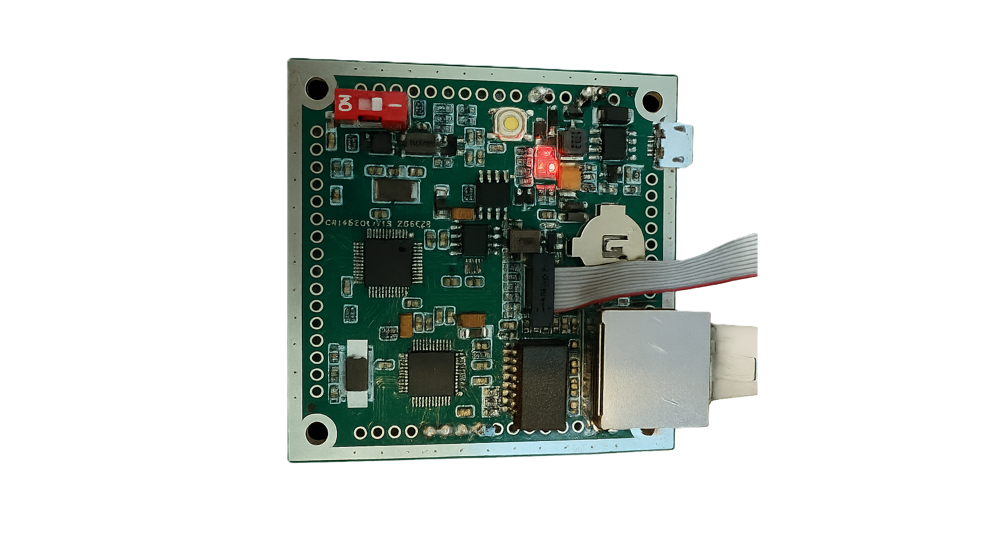

# Smart Traffic Edge Node with STM32F103 & W5500

<div align="center">
  
</div>

An industrial-grade edge node solution for smart traffic management, combining STM32F103C8T6 and W5500 Ethernet with ROS 2 capabilities for real-time processing and decision-making.

## Purpose

This solution revolutionizes traffic management by bringing powerful ROS 2 capabilities to the network edge, enabling:
- Real-time traffic monitoring and control
- Local processing for reduced latency
- Seamless integration with smart city infrastructure
- Reliable operation in harsh environments

## Features

- **Hardware**
  - STM32F103C8T6 (72MHz Cortex-M3)
  - W5500 Ethernet controller with hardware TCP/IP
  - Industrial-grade components for 24/7 operation

- **Software**
  - FreeRTOS for real-time operations
  - micro-ROS for ROS 2 integration
  - Watchdog and fail-safe mechanisms

- **Networking**
  - Static & DHCP support
  - TCP/UDP protocols
  - Secure communication channels

## Quick Start

1. **Clone the repository**
   ```bash
   git clone --recursive https://github.com/yourusername/stm32f103_w5500.git
   cd stm32f103_w5500
   ```

2. **Update submodules**
   ```bash
   git submodule update --init --recursive
   ```

3. **Open in your IDE**
   - Open the project in STM32CubeIDE
   - Build and flash to your board

## System Architecture

```
┌───────────────────────────────────────────────────────────────────────�n│                      Central Traffic Management                      │
│  ┌───────────────┐    ┌────────────────┐    ┌──────────────────┐  │
│  │  Cloud/Server │◄───┤  Edge Router    │◄───┤  Local Network   │  │
│  └───────────────┘    └────────────────┘    └──────────────────┘  │
└───────────────────────────────────────────────────────────▲──────────┘
                                                          │
                                                          │
┌──────────────────────────────────────────────────────────▼──────────┐
│                                                                   │
│  ┌───────────────────────────────────────────────────────────────┐  │
│  │                     Smart Traffic Node                       │  │
│  │  ┌─────────────┐    ┌────────────────┐    ┌───────────────┐  │  │
│  │  │   Sensors   │    │  STM32F103     │    │  W5500        │  │  │
│  │  │ (Vehicle,   │◄───┤  + FreeRTOS    │◄───┤  Ethernet     │◄─┼──┘
│  │  │  Pedestrian)│    │  + micro-ROS   │    │  Controller   │  │
│  │  └─────────────┘    └────────────────┘    └───────────────┘  │
│  └───────────────────────────────────────────────────────────────┘  │
│                                                                   │
└───────────────────────────────────────────────────────────────────┘
```

## Project Structure

```
stm32f103_w5500/
├── Core/                    # Traffic control logic
├── Drivers/                 # STM32 HAL drivers
├── Middlewares/             # W5500 and micro-ROS
└── docs/                    # Documentation
```

## Dependencies

- STM32CubeMX
- STM32CubeIDE or your preferred ARM toolchain
- Terminal emulator (PuTTY, Tera Term, etc.)

## License

[Your License Here]

---
*Project maintained by [Your Name]*
│       └── STM32_USB_Device_Library/     # USB device stack
│
├── USB_DEVICE/            # USB Device configuration
├── .mxproject              # STM32CubeMX project file
└── README.md               # This file
```

## Hardware Setup

### Components
- STM32F103C8T6 Blue Pill board
- W5500 Ethernet module
- USB-TTL converter (for debugging)
- ST-Link V2 programmer
- Ethernet cable

### Pin Connections

| STM32F103 | W5500 Module |
|-----------|--------------|
| 3.3V     | 3.3V         |
| GND      | GND          |
| PB13     | SCK          |
| PB14     | MISO         |
| PB15     | MOSI         |
| PB12     | SS           |
| PB0      | RST          |
| PB1      | INT          |


## Getting Started

### Prerequisites
- STM32CubeIDE or your preferred ARM development environment
- ST-Link Utility or OpenOCD for flashing
- Terminal emulator (PuTTY, Tera Term, or similar)
- Python 3.x (for additional tools)

### Building the Project

1. Clone the repository with submodules:
   ```bash
   git clone --recursive https://github.com/yourusername/stm32f103_w5500.git
   cd stm32f103_w5500
   ```

2. Open the project in STM32CubeIDE
   - Select `File > Import > Existing Projects into Workspace`
   - Navigate to the project directory and select it

3. Build the project
   - Right-click on the project in Project Explorer
   - Select `Build Project` or press `Ctrl+B`

### Flashing the Firmware

1. Connect your ST-Link programmer to the board
2. In STM32CubeIDE:
   - Right-click on the project
   - Select `Debug As > STM32 Cortex-M C/C++ Application`
   - The debug configuration will be automatically created

### Network Configuration

By default, the device uses the following static IP configuration:
- IP: 192.168.68.200
- Netmask: 255.255.255.0
- Gateway: 192.168.68.1
- MAC: 00:08:DC:00:00:01

To change these settings, modify the `eth_config_init_static()` function in `Core/Src/eth_config.c`.

## Using micro-ROS

The project includes micro-ROS support with a custom W5500 transport layer. To use micro-ROS:

1. Set up a ROS 2 environment on your host machine
2. Start the micro-ROS agent:
   ```bash
   ros2 run micro_ros_agent micro_ros_agent udp4 --port 8888
   ```
3. The STM32 will automatically connect to the agent on startup

## Debugging

### ITM Console
For debugging output, connect an SWD debugger and use the ITM console:
1. Open a terminal emulator at 115200 baud
2. Connect to the ITM port (usually COMx in Windows)
3. Debug messages will be displayed in real-time

### LED Indicators
- **LED1 (PC13)**: Heartbeat (1Hz blink when running)
- **LED2 (PA1)**: Ethernet link status
- **LED3 (PA2)**: Network activity

## License

This project is licensed under the MIT License - see the [LICENSE](LICENSE) file for details.

## Contributing

Contributions are welcome! Please feel free to submit a Pull Request.

```
│
├── Core/                    # Core STM32 application code
│   ├── Inc/                 # Header files
│   ├── Src/                 # Source files
│   └── Startup/             # Startup files for STM32F103
│
├── Drivers/                 # STM32 HAL and CMSIS drivers
│   ├── CMSIS/               # CMSIS V2 files
│   └── STM32F1xx_HAL_Driver/# STM32F1 HAL drivers
│
├── Middlewares/            # Middleware components
│   ├── In_House/          # Custom implementations
│   │   ├── custom_reponses/# Custom protocol handlers (e.g., ICMP)
│   │   └── custom_transports/ # Custom transport layers
│   │       └── w5500_transport.[c/h] # W5500 transport for micro-ROS
│   │
│   └── Third_Party/        # Third-party libraries
│       ├── FreeRTOS/       # FreeRTOS implementation
│       ├── ioLibrary_Driver/# W5500 driver library
│       │   ├── Ethernet/   # Ethernet implementation
│       │   ├── Internet/   # Internet protocols
│       │   └── Application/# Example applications
│       │
│       └── micro_ros_stm32cubemx_utils/ # micro-ROS utilities and examples
│           ├── extra_sources/           # Custom transport implementations
│           │   └── microros_transports/ # Transport layer implementations
│           ├── microros_static_library/ # Static library build system
│           └── sample_main_w5500.c      # Example micro-ROS application
│
├── docs/                   # Project documentation
│   └── modify_wizchip_conf.md # W5500 driver modifications
│
├── .gitignore              # Git ignore file
├── README.md               # Project readme (this file)
├── STM32F103C8TX_FLASH.ld  # Linker script
└── stm32f103_w5500.ioc    # STM32CubeMX project file
```

## Hardware Setup

### STM32F103C8T6 to W5500 Connections

| STM32F103 Pin | W5500 Pin | Description |
## Contributing

Contributions are welcome! Please feel free to submit a Pull Request.

## License

This project is licensed under the MIT License - see the [LICENSE](LICENSE) file for details.

## References

- [W5500 Datasheet](https://www.wiznet.io/product-item/w5500/)
- [STM32F103 Reference Manual](https://www.st.com/resource/en/reference_manual/cd00171190-stm32f101xx-stm32f102xx-stm32f103xx-stm32f105xx-and-stm32f107xx-advanced-arm-based-32-bit-mcus-stmicroelectronics.pdf)
- [CMSIS V2 Documentation](https://arm-software.github.io/CMSIS_5/General/html/index.html)
- [ioLibrary_Driver GitHub](https://github.com/Wiznet/ioLibrary_Driver)
- [micro-ROS Documentation](https://micro.ros.org/)
- [STM32CubeIDE](https://www.st.com/en/development-tools/stm32cubeide.html)
For detailed information about micro-ROS integration, please refer to the [micro-ROS documentation](https://micro.ros.org/).